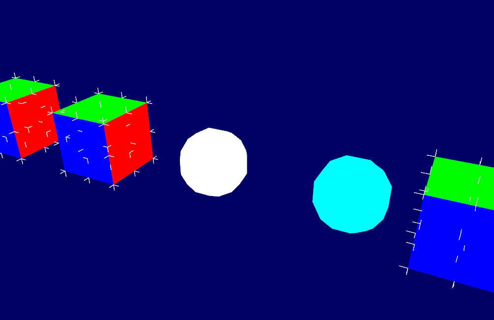
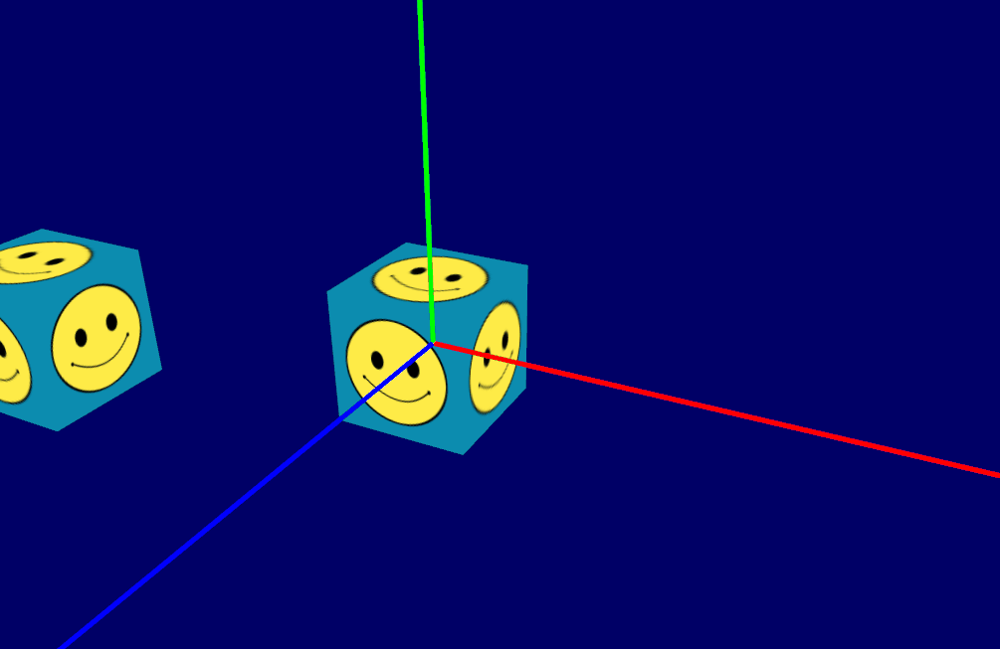
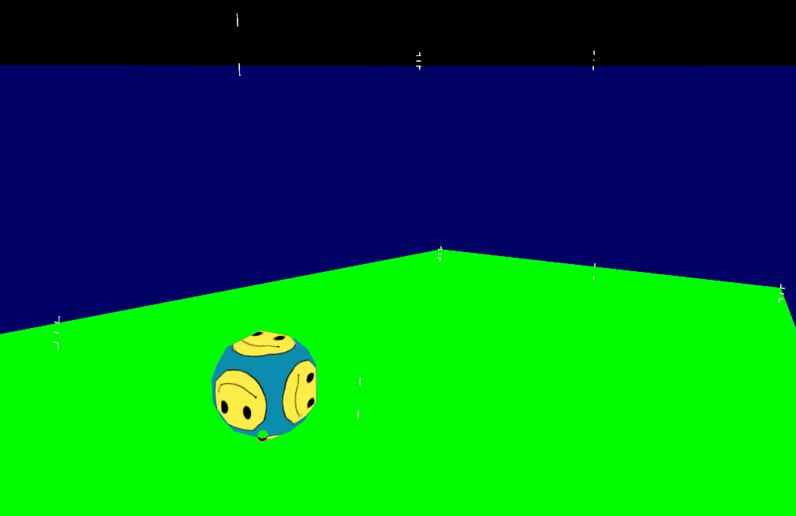

# Rigidy physics engine
Basic physics engine written in C++ and using OpenGL. It supports basic collision detection and response of primitives (such as spheres and cubes), and includes debugging tools. The primitives are created and manipulable in real time, collision detection is based on the Separating Axis Theorem, and Newton's laws of motion are used for collision resolution. This is still a work in progress, but the state of the project can be seen in the following videos.

|Bounce test| Cube collision| Sphere roll|
|:---|:---|:--- |
||||